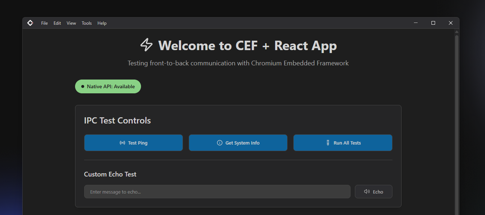

# CEF Quickstart




CEF Quickstart is a lightweight, cross-platform webview application built with C++ and CEF (Chromium Embedded Framework). It provides a simple yet powerful interface for embedding web content within native applications.

## Features

- 🚀 **Fast Performance**: Native C++ backend with optimized web-based frontend
- 🎨 **Modern UI**: Clean, responsive interface built with React.js and TypeScript
- 🛠️ **CMake Integration**: Seamless project building and management

## Architecture

```
cef-quickstart/
├── app/                    # C++ application core
│   ├── main.cpp           # Application entry point
│   ├── client.cpp         # WebView client implementation
├── cef-quickstart/             # TypeScript frontend (React.js + Vite)
│   ├── src/               # Frontend source code
│   └── components/        # React.js components
└── tools/                 # Build and utility tools
    ├── build.ts           # CMake build automation
    ├── clean.ts           # Project cleanup utility
    └── utils/             # Conversion utilities
```

## Prerequisites

- **Windows 10/11** with MSVC (Visual Studio 2019 or later)
- **CMake 3.25+**
- **Bun.js** (latest version)
- **Git** with submodule support

## Quick Start

### 1. Clone the Repository

```bash
git clone https://github.com/arizkami/cef-quickstart.git
cd cef-quickstart
```

### 2. Install Dependencies

```bash
bun install
```

### 3. Build the Project

```bash
# Build frontend
bun run build

# build all
bun run build:win
```

### 4. Run CEF Quickstart

```bash
.\build\Release\cef-quickstart.exe
```

## Development

### Available Scripts

- `bun run dev` - Start development server for frontend
- `bun run build` - Build production frontend
- `bun run preview` - Preview built frontend
- `bun run build:cmake <project>` - Build specific CMake project
- `bun run clean:cmake <project>` - Clean specific CMake project
- `bun run buildtobin` - Convert HTML to C++ binary
- `bun run iconconvert` - Convert PNG to ICO format

### Project Structure

#### Frontend (webapp/)
Built with React.js, TypeScript, and Vite for fast development and optimal performance.

#### Backend (app/)
C++ application using:
- **Chromium Embedded Framework (CEF)** for rendering the frontend
- **Binary Resource Provider** for embedded web assets
- **Logger** for debugging and diagnostics

### Build Tools

Custom TypeScript build tools provide:
- **Automated CMake builds** with proper configuration
- **Project cleanup** with selective artifact removal
- **Resource conversion** from web assets to C++ binaries
- **Cross-platform compatibility** (Windows focus)

## Contributing

1. Fork the repository
2. Create a feature branch (`git checkout -b feature/amazing-feature`)
3. Commit your changes (`git commit -m 'Add amazing feature'`)
4. Push to the branch (`git push origin feature/amazing-feature`)
5. Open a Pull Request

### Development Guidelines

- Use **Bun.js** for all JavaScript/TypeScript operations
- Use **CMake** for all C++ builds (MSVC on Windows)
- Follow existing code style and conventions
- Add tests for new features
- Update documentation as needed

## License

This project is licensed under the MIT License - see the [LICENSE](LICENSE) file for details.

## Acknowledgments

- Built with modern C++ and TypeScript
- Powered by CMake and Bun.js
- LSP integration for enhanced development experience
- Chromium Embedded Framework for seamless web-native integration

---
**CEF Quickstart** - WebView with native performance
